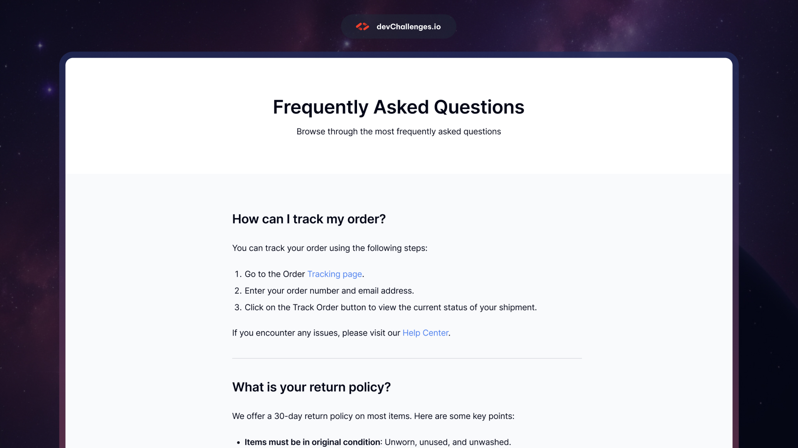

A simple FAQ page to test HTML & CSS syntax

The goals of this project are:
1. Understand the basics of HTML and CSS syntax
2. Learn how to structure and style a web page using HTML and CSS
3. Practice creating and formatting text content
4. Practice creating and styling headings, paragraphs, and lists
5. Practice creating and styling links
6. Practice creating and styling a simple FAQ layout

Image: 
